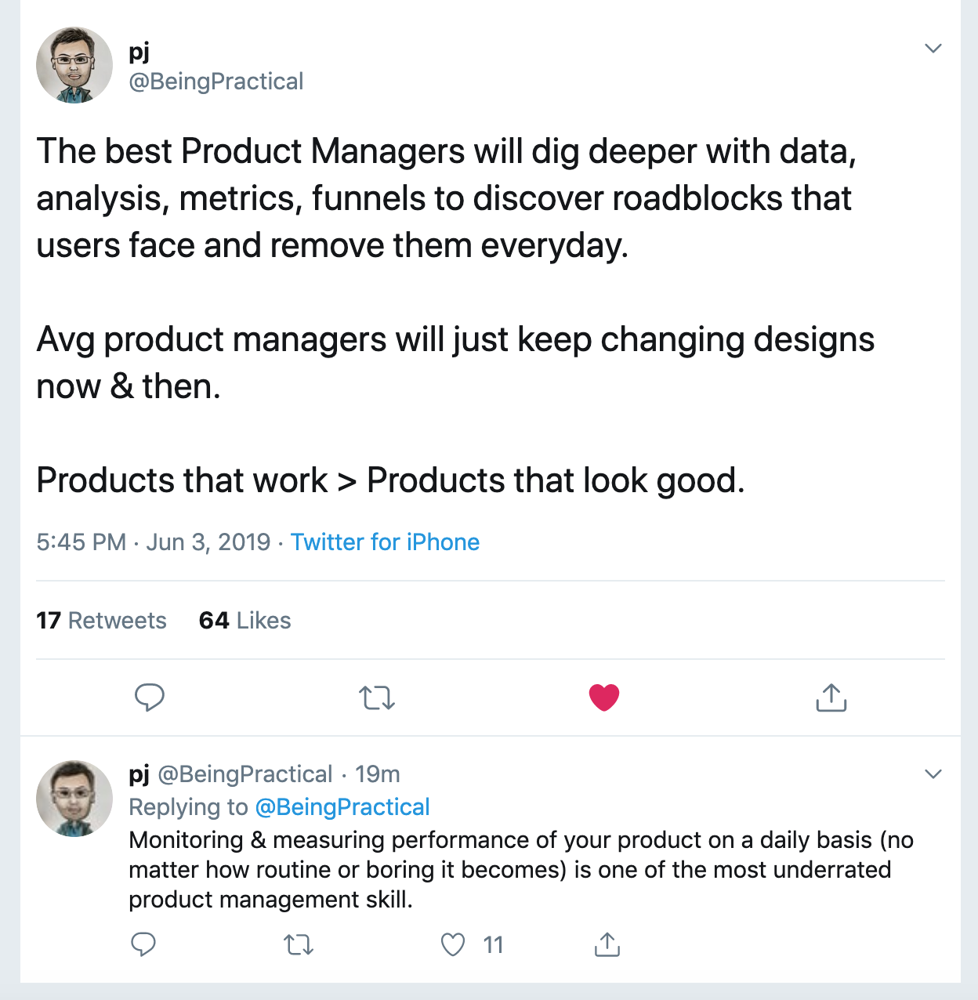

Back in the late 90s, as a child I watched few road side magic shows. Little did I know then a PM is expected to be the magician in a software organisation.

Magic shows are great fun! While they don’t excite me now as much as they used to, I’d still love to watch them trying to understand how the magician connects with the audience and masterfully performs his tricks while thousands of eyes try to find the ‘how’ of the act.

I noticed there are some common themes both a magician and a product manager follows. 

## Metrics & Numbers
Magicians are good with numbers. And they adapt their dialogue and presentation to the audience reactions well. So much that they instantly know whom to pull on to the stage just by takin a quick glance at the whole audience. This is true with stand up comedians too. They know exactly who their audience are. This makes them powerful. 

As product managers, though we do not get that ‘real time’  insights to the users,  it is important that we dig the data and get the metrics. Great product managers do this as a routine. 

## Showing something that isn’t there
I’d not call this fooling the users. But gauging the interest and the ROI even before building the product. We tried this for the first product startup I worked for, ClickDesk. In the initial days when we just launched the MVP and are aggressively building the product, there’s a huge feature backlog. We used these feature inquiries from the website visitors and signed up users (potentially will turn to become paid users) to set the priorities on what to build next.  

With right communication and super fast execution, this turned out to be a great move, since the customers are invested in getting us ship out the feature. It gives the customers the feeling of being involved as partners and feature owners. 

## But, there’s one more thing
The best magicians keep the exclusive and mind boggling trick to the last, so the users leave impressed. Same is true with great PMs. 

Remember the famous ‘one more thing’, from Steve Jobs? Here’s a compilation of all those from Steve Jobs. Also, do watch the **one last thing** documentory. 
[Steve Jobs ‘One more thing   ‘ complete compilation 1999 2011 - YouTube](https://www.youtube.com/watch?v=sdqMvEZTxlI)

## WoWing the users
Exceptionally well executed magic shows wow the audience at quick intervals. People look forward to what’s coming up next as they watch glued to their seats and cheer the show. 

When was the last time you were wow’d by the user experience of using a product? For me, it’s when I first used the CRED app recently.

## Feedback & Social Validation
In India, when the word magic or magician is heard, PC Sorkar (Jr) is the name that instantly follows in the mind. How does one attain such celebrity status for their show? Simple - be extremely good at what you do. Iterate fast and often by listening to the cues from customers.

Having a social proof (testimonials or customer logos) on the websites and landing pages will make the us feel confident while subscribing or making a purchase. It’s because we know, we are in trusted hands when we see people like us or better are using a product. Word of mouth through platforms like twitter are great source to get new leads. Easiest way to get the customers to bat for you, is to listen to them. Their experience in using your product, their feedback, suggestions, ideas and how your product can help fix their problems. Working on this tells how committed we are as product guys and will win understanding customers during rough weather. 

This post is inspired by the a tshirt quote by the awesome folks at [Pratilipi.com (@TeamPratilipi) | Twitter](https://twitter.com/teampratilipi). The quote said, “I’m a PM, not a magician” :)